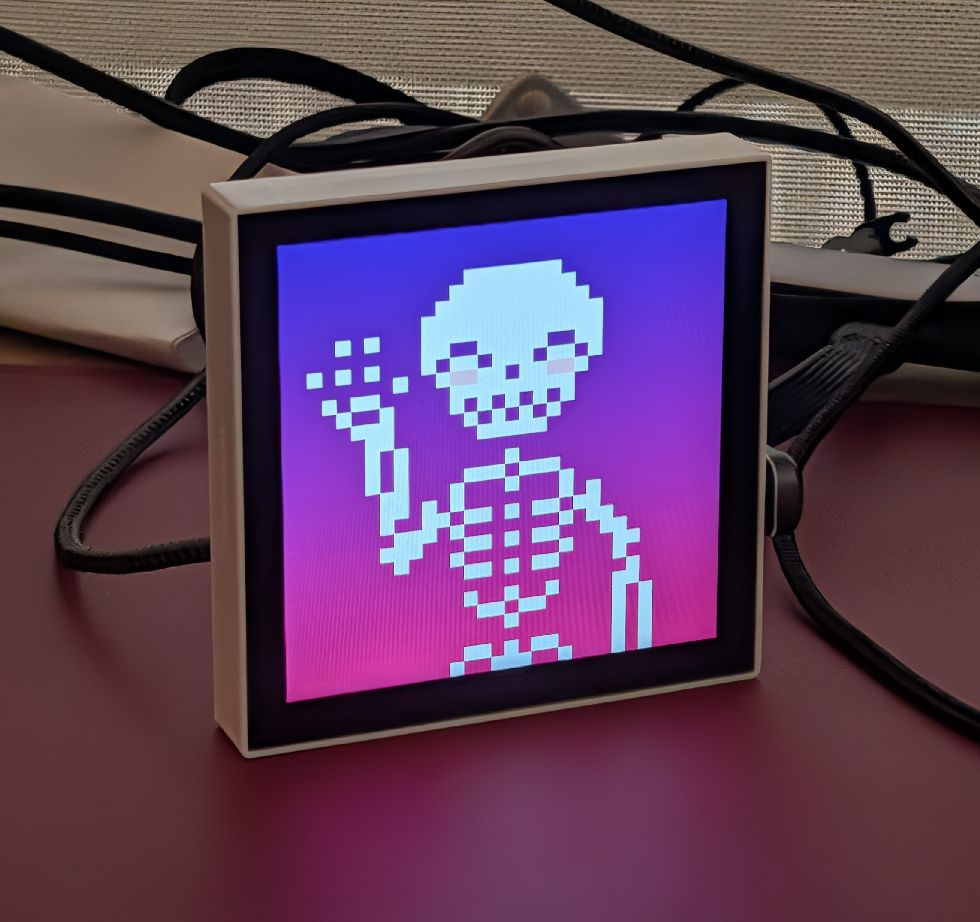
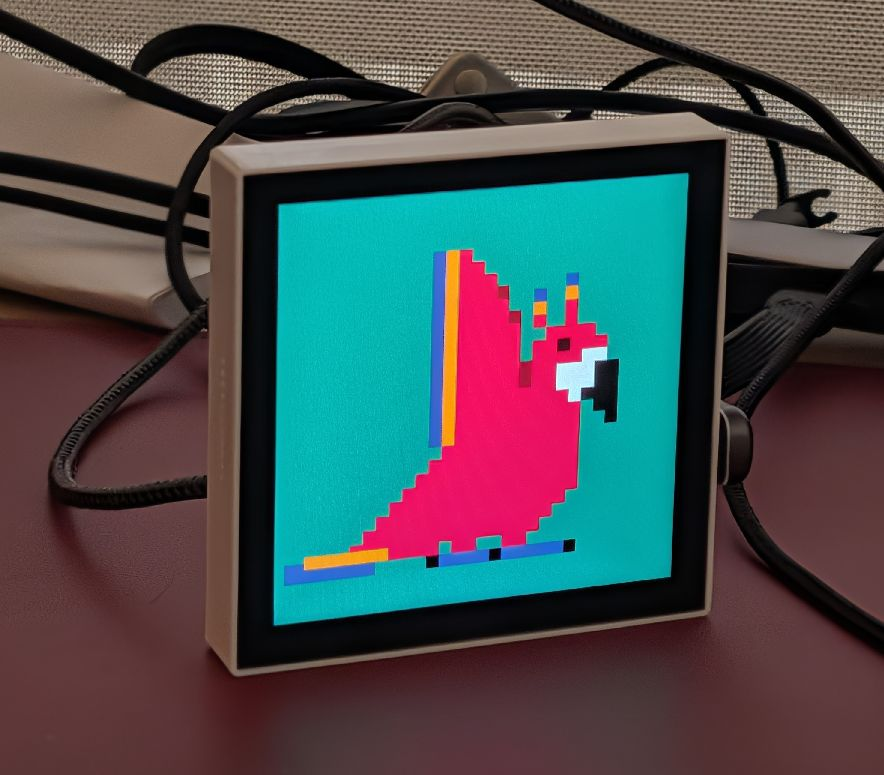

# P3A (Pixel Pea) — Makapix Physical Player

P3A ("Pixel Pea") is a physical pixel art player inside the Makapix Club ecosystem. It is an ESP32-P4-powered Wi-Fi art frame that subscribes to Makapix feeds, displays pixel artworks, and lets viewers react (likes) or skim comments without leaving the hardware experience.

## Hardware photos

  
  

## Hardware platform & specs
- **Board**: [Waveshare ESP32-P4-WIFI6-Touch-LCD-4B](https://www.waveshare.com/product/arduino/boards-kits/esp32-p4/esp32-p4-wifi6-touch-lcd-4b.htm?sku=31416) — dual-core ESP32-P4 host MCU plus onboard ESP32-C6 for Wi-Fi 6/BLE, external PSRAM, and ample flash as provided by the module.
- **Display**: 4" square 720×720 IPS panel over 2-lane MIPI-DSI with PWM-dimmable backlight.
- **Touch**: GT911 capacitive touch controller (I²C) with multi-point reporting.
- **Storage**: microSD slot exposed through ESP-IDF VFS and used for artwork caching.
- **Audio**: ES8311 codec wired to a class-D amplifier (future playlist audio cues / voice prompts).
- **I/O**: GPIO expansion, USB-C power/debug, onboard LEDs, and provision for speakers/mics per BSP.

## Current firmware capabilities
- **Display bring-up (main/app_lcd_p4.c)**
  - Uses the Waveshare BSP to init the DSI panel, negotiate 1–3 frame buffers, and optionally enable cache flushes (`CONFIG_P3A_LCD_ENABLE_CACHE_FLUSH`).
  - Brightness control is abstracted through BSP PWM helpers; values are clamped between 0–100% and tracked globally.
- **Animation playback pipeline (main/animation_player.c + decoders)**
  - Mounts the SD card via BSP, recursively finds the first directory that contains `.webp`, `.gif`, `.png`, `.jpg`, or `.jpeg` files, and keeps an alphabetised manifest.
  - Background loader task streams each asset into RAM, selects the proper decoder (libwebp, libpng, animated-gif, ESP hardware JPEG), builds upscale lookup tables, and prefetches frame 0 so that swaps feel instant.
  - Multi-buffer renderer drives the LCD refresh task, respects VSYNC when multiple panel buffers are available, and spawns parallel upscaling workers to stretch source canvases (typically 128×128) to the native 720×720 framebuffer without tearing.
  - Auto-randomise on boot and swap logic: manual swaps queue loader work, prefetch completes on the render task, and faulted assets are discarded without wedging the UI.
- **Touch & gestures (main/app_touch.c)**
  - Polls GT911 at 20 ms, maintains a gesture state machine, and differentiates taps (left half = previous animation, right half = next) from vertical swipes used to change brightness.
  - Brightness gesture sensitivity (`CONFIG_P3A_TOUCH_SWIPE_MIN_HEIGHT_PERCENT`) and maximum step per swipe (`CONFIG_P3A_TOUCH_BRIGHTNESS_MAX_DELTA_PERCENT`) are configurable via `menuconfig`.
- **Auto-swap UX (main/p3a_main.c)**
  - At boot the firmware launches an auto-swap task that cycles to a random animation every 30 seconds. Manual interaction resets the timer.
- **Configuration surface (main/Kconfig.projbuild)**
  - Project-level toggles for SD asset location, animation scheduling (e.g., `CONFIG_P3A_MAX_SPEED_PLAYBACK`), render/touch task priorities, and RGB565 vs RGB888 framebuffer formats.

## Planned functionality (see ROADMAP.md)
P3A is still in the **display prototype** stage. The roadmap tracks the remaining milestones, grouped below:

- **Connectivity & backend**
  - Bring up ESP32-C6 Wi-Fi 6 path, provisioning (captive portal or BLE), TLS MQTT client, and Makapix REST helpers for asset metadata.
  - Subscribe to `posts/new` style topics, download verified artwork bundles, cache them, and expose "send like / read likes / read comments" shortcuts mandated in the Makapix physical-player spec.
- **Playback intelligence**
  - Validate SHA hashes before display, fall back to on-device cache/offline playlists, honor playlist metadata from Makapix, enforce canvas constraints.
  - Extend gesture map (double-tap to like, press-and-hold for comments overlay) and add LVGL-based HUD for Wi-Fi/MQTT state, brightness, and diagnostics.
- **Reliability & security**
  - OTA with two-slot partition table, crash-safe rollbacks, watchdog coverage, telemetry/diagnostics, and secure provisioning tooling.
  - Content safety: allowlist asset hosts, reject SVG or oversized payloads, pin MQTT certs, and log moderation flags locally.
- **Manufacturing, CI, docs**
  - Automated provisioning scripts, release pipeline that builds signed OTA images, and doc set for installers and support teams.

See `ROADMAP.md` for the detailed phase-by-phase breakdown.

## Build & flash
1. Install **ESP-IDF v5.5.x** with the `esp32p4` target (IDF Component Registry dependencies are auto-synced via `idf.py`).
2. In this repo, set the target once: `idf.py set-target esp32p4`.
3. Optionally tweak project options via `idf.py menuconfig` (display format, gesture thresholds, animation path, task priorities).
4. Build & flash: `idf.py build flash monitor`. Use `-p PORT`/`-b BAUD` as needed.

### Preparing artwork media
- Format a microSD card (FAT32) and copy your pixel art loops into `/sdcard/animations` (or any folder that only contains supported formats; the firmware will pick the first such folder it finds).
- Supported containers today: animated/non-animated **WebP, GIF, PNG, JPEG**. Source canvases are upscaled to 720×720 so keep square canvases (128×128 is the Makapix default).
- Insert the microSD before booting. The firmware logs will enumerate how many assets were found and start playback automatically.

### On-device controls
- **Tap right half**: advance to the next animation.
- **Tap left half**: go back to the previous animation.
- **Vertical swipe**: adjust brightness proportionally to the swipe distance; swiping up brightens, swiping down dims.
- **Idle auto-swap**: every 30 s the unit picks a random animation unless the user has interacted recently.

## Repository layout
- `main/` — application entry point, LCD/touch wrappers, animation player, and format decoders.
- `components/` — vendored decoders (animated GIF, libwebp support glue).
- `managed_components/` — ESP-IDF Component Registry dependencies (Waveshare BSP, esp_lcd_touch, libpng, etc.).
- `def/` — sdkconfig defaults for the esp32p4 target.
- `ROADMAP.md` — execution plan for each firmware milestone.
- `makapix_full_project_spec.md` — end-to-end Makapix backend/product specification.

## Makapix integration primer
Makapix is a pixel-art social network that hosts artworks and offers metadata, moderation, reactions, and MQTT notifications. P3A’s planned role is:
- Subscribe to Makapix MQTT to fetch the URLs for new artworks/playlists.
- Download media over HTTPS, and display or cache it locally for offline rotation.
- Allow viewers to send a like and to fetch the likes and comments for the focused post.

Contributions are welcome!
